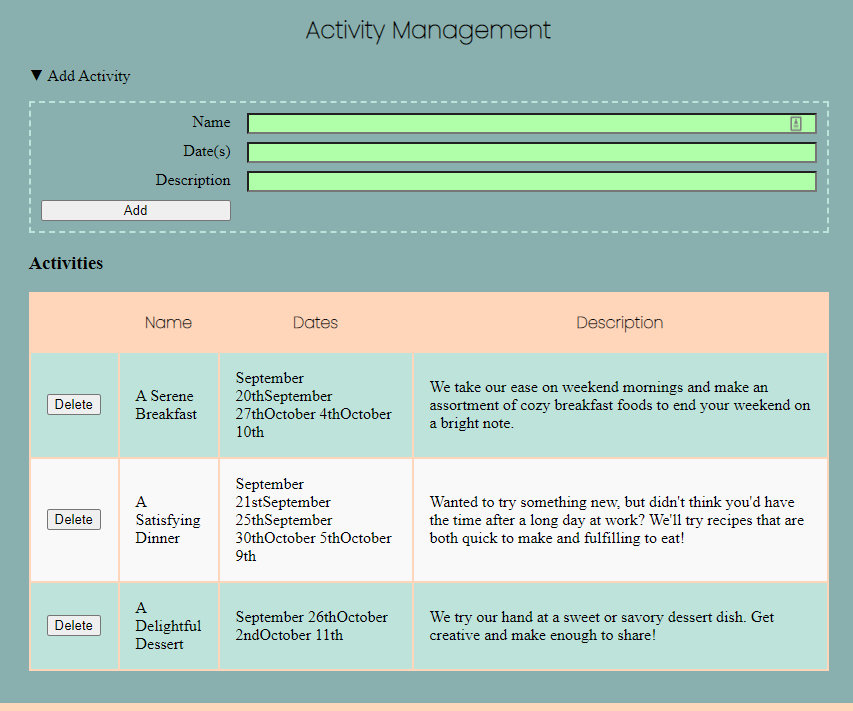
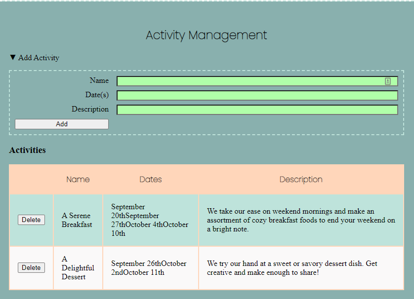
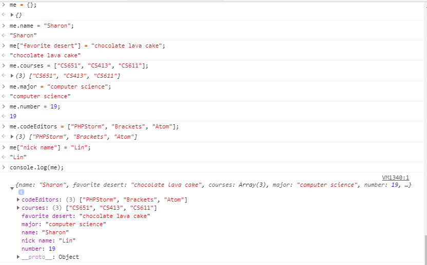
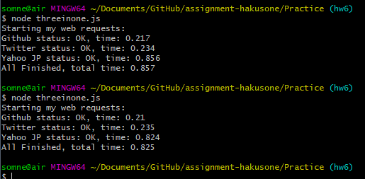

**Student Name**:  Sharon Wong

**NetID**: hd3647

# Homework #7 Solutions

## Question 1

### (a)

Add a new function to App that will change the state to what is specified in the state parameter. When calling the menu item, we will now bind the new function (with reference to the App as `this`), so that the child component can use the function.

The new function:
```javascript
switchShow(state) {
  this.setState({show: state});
}

```

Calling menu:
```javascript
    <Menu role={this.state.role} show={this.state.show} switchShow={this.switchShow.bind(this)}/>
```

### (b)

In menu, we bind a local switchShow function that will be called when the option is clicked.

```javascript
case "membership":
  displayNavOptions.push(<li key="membership" className={isActive} onClick={menu.switchShow.bind(menu, 'membership')}><a>Sign Up</a></li>);
  break;
```

## Question 2

### (a)


### (b)

### (c)


### (d)

AdminActivity
```javascript
class AdminActivity extends React.Component {
  constructor(props) {
    super(props);
    this.state = {
      events: this.props.events
    }
  }
```

AddActivity
```javascript
class AddActivity extends React.Component {
  constructor(props) {
    super(props);
    this.state = {
      name: '',
      dates: '',
      description: ''
    }
    this.addActivity = props.addActivity;
  }
```

### (e)

```javascript
let main = <div className="add-activity">
  <form className="grid-form">
    <label>Name</label>
    <input type="text" name="name" onChange={this.updateValue.bind(this, 'name')} />
    <label>Date(s)</label>
    <input type="text" name="dates" onChange={this.updateValue.bind(this, 'dates')} />
    <label>Description</label>
    <input type="text" name="description" onChange={this.updateValue.bind(this, 'description')} />
    <button type="button" onClick={this.addActivityData.bind(this)}>Add</button>
  </form>
</div>;

```

### (f)

AdminActivity
```javascript
  addActivity(activity) {
    this.setState({events: this.state.events.concat(activity)});
  }
```

AddActivity
```javascript
  updateValue(prop, event) {
    this.state[prop] = event.currentTarget.value;
  }

  addActivityData() {
    let eventData = {
      name: this.state.name,
      dates: this.state.dates,
      description: this.state.description
    }

    this.addActivity(eventData);
  }
```

## Question 3

### (a)





### (b)

```javascript
return <tr key={"event"+i}>
          <td><button type="button" onClick={admin.deleteActivity.bind(admin, i)}>Delete</button></td>
          <td>{event.name}</td>
          <td>{event.dates}</td>
          <td>{event.description}</td>
       </tr>;
```

### (c)

```javascript
deleteActivity(i) {
  let updateEvents = this.state.events.filter(function(event, index) {
    return index != i;
  });
  this.setState({events:updateEvents});
}

```

### (d)

[Link to website](http://csweb01.csueastbay.edu/~hd3647/clubReact_hw7/)

## Question 4

### (a)

It will print out:
```
Is this the start?
When does this print?
Is this the end?
this is a msg from CS651
This is a msg from CS351
```
`setTimeout()` is a function that will execute a function after a specified amount of time. One `setTimeout()` call has no parameter and defaults to 0, while the other call is specified to be 0. They both look like they should be run immediately, except that modern browsers have throttling in place when successive callbacks are executed, delaying each call by 4ms. Hence the `console.log()` calls are executed immediately and the `setTimeout()` calls are slightly delayed.

Source: [MDN](https://developer.mozilla.org/en-US/docs/Web/API/WindowOrWorkerGlobalScope/setTimeout)

### (b)

`Promise.race` takes a number of promises and runs them at the same time, and returns the value of which promise finishes first. Since the promises have random timeouts, we can find out who wins the race by adding an additional statement to output the value of the winning promise like so:

```javascript
let racingPs = Promise.race(myPs).then(function(value) {
  winner(value);
});
```

Source: [MDN](https://developer.mozilla.org/en-US/docs/Web/JavaScript/Reference/Global_Objects/Promise/race)

### (c)



### (d)


