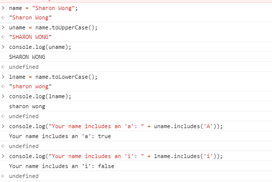
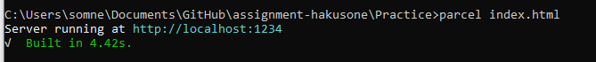
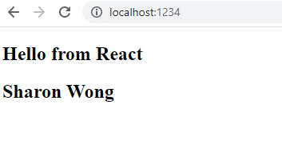
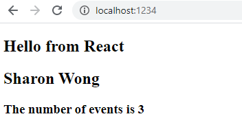

**Student Name**:  Sharon Wong

**NetID**: hd3647

# Homework #5 Solutions

## Question 1

### (a)

### (b)

```html
<nav>
  <ul>
    <li><a href="index.html">Home</a></li>
    <li><a href="activities.html">Activities</a></li>
    <li class="active"><a href="login.html">Login</a></li>
    <li><a href="signup.html">Sign Up</a></li>
  </ul>
</nav>
```

```css
nav {
  background-color: #faf9f9;
  padding: 1em;
  border-width: 2px;
  border-color: #bee3db;
  border-style: dashed;
  position: fixed;
  width: 100%;
  top: 0;
  left: 0;
}

nav > ul {
  list-style-type: none;
  display: flex;
  flex-direction: row;
  justify-content: space-around;
}
```

## Question 2

### (a)

I would use em.

```css
body {
  background-color: #ffd6ba;
  padding: 5em 3em;
  display: flex;
  flex-direction: column;
  align-items: center;
}

main {
  background-color: #89b0ae;
  padding: 2em;
  width: 50em;
}
```

### (b)

```css
.grid-form {
  display: grid;
  grid-template-columns: 1fr 3fr;
  grid-template-rows: auto;
  column-gap: 1em;
  row-gap: 0.5em;
}

.grid-form label {
  justify-self: end;
}
```

### (c)

[Link to website](http://csweb01.csueastbay.edu/~hd3647/clubProject_hw5/index.html)

## Question 3

### (a)

Node.js v12.18.4.

### (b)

```javascript
const fs = require('fs');
let fname = __dirname + '/index.html';
let fdata = fs.readFileSync(fname, 'utf-8');
let flines = fdata.split('\n');
console.log('Lines in file index.html: ' + flines.length);
```


### (c)

```JSON
events = [
  {
    "name": "A Serene Breakfast",
    "dates": [
      "September 20th",
      "September 27th",
      "October 4th",
      "October 10th"
    ],
    "description": "We take our ease on weekend mornings and make an assortment of cozy breakfast foods to end your weekend on a bright note."
  },
  {
    "name": "A Satisfying Dinner",
    "dates": [
      "September 21st",
      "September 25th",
      "September 30th",
      "October 5th",
      "October 9th"
    ],
    "description": "Wanted to try something new, but didn't think you'd have the time after a long day at work? We'll try recipes that are both quick to make and fulfilling to eat!"
  },
  {
    "name": "A Delightful Dessert",
    "dates": [
      "September 26th",
      "October 2nd",
      "October 11th"
    ],
    "description": "We try our hand at a sweet or savory dessert dish. Get creative and make enough to share!"
  }
];
```

### (d)

```javascript
const fs = require('fs');
let fname = __dirname + '/eventData.json';
let fdata = fs.readFileSync(fname, 'utf-8');
let eventData = JSON.parse(fdata);

eventData.events.forEach(function (event) {
  console.log(event.name);
  console.log(event.dates.join(', '));
  console.log(event.description);
});
```



## Question 4

### (a)

Used `npm init` command in the Practice folder and filled in the prompts.

### (b)

```JSON
{
  "name": "practice",
  "version": "1.0.0",
  "description": "a practice package",
  "main": "index.html",
  "scripts": {
    "test": "echo \"Error: no test specified\" && exit 1"
  },
  "author": "",
  "license": "ISC",
  "dependencies": {
    "react": "^16.13.1",
    "react-dom": "^16.13.1"
  }
}
```

### (c)

### (d)

### (e)






## Question 5

### (a)



### (b)


