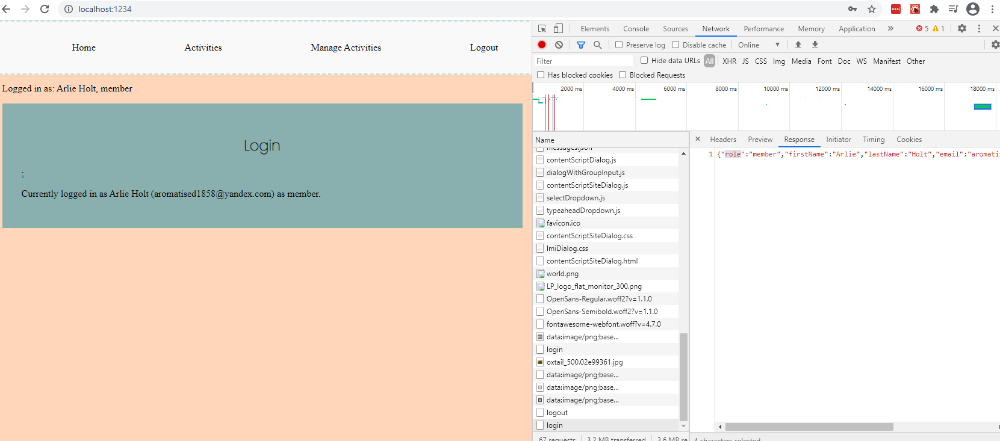
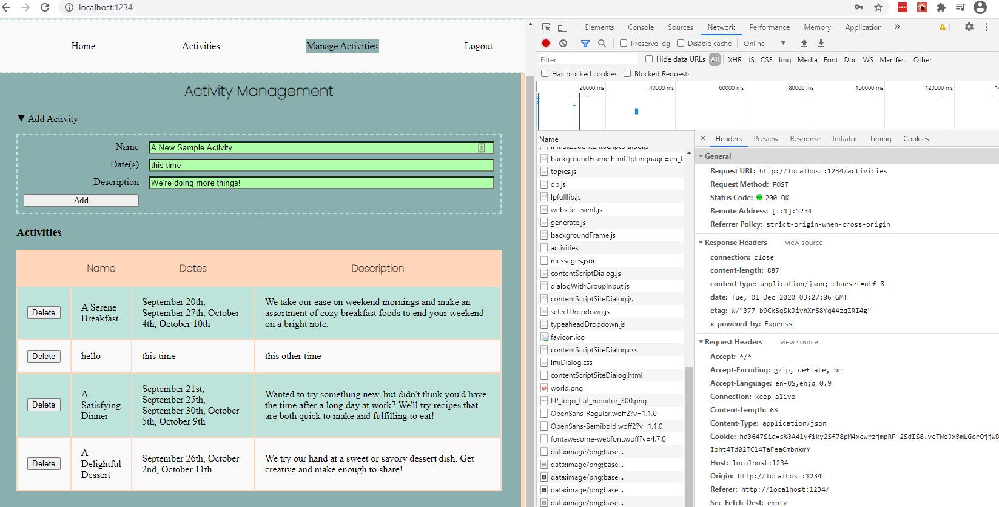
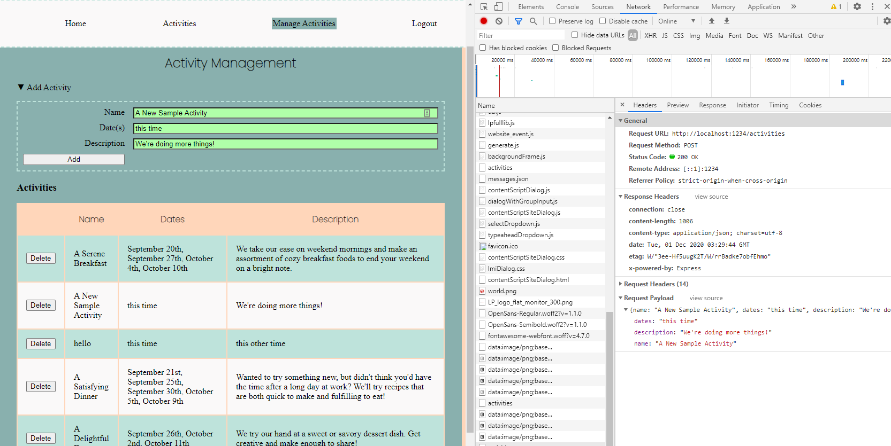
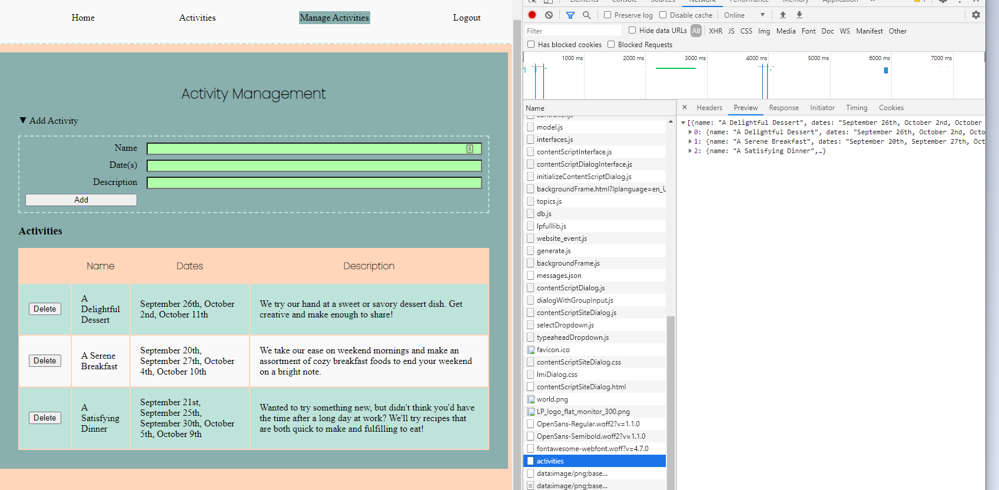

**Student Name**:  Sharon Wong

**NetID**: hd3647

# Homework #12 Solutions

## Question 1

### (a)

```javascript

class Login extends React.Component {
  constructor(props) {
    super(props);

    this.state = {
      email: '',
      password: '',
      hasError: false
    };

    this.updateUser = props.updateUser;
  }

  updateValue(prop, event) {
    this.state[prop] = event.currentTarget.value;
  }

  loginUser() {
    let login = this;
    let body = {
      email: this.state.email,
      password: this.state.password
    };

    let hasError = false;

    fetch('login', {
      method: "POST",
      body: JSON.stringify(body),
      headers: {'Content-type': 'application/json'}
    })
    .then(res => res.json())
    .then(function(data) {
      if (data.error) {
        login.setState({
          hasError: true,
          errorMsg: data.message
        });
      }
      else {
        login.updateUser({
            role: data.role,
            email: data.email,
            name: data.firstName + ' ' + data.lastName
        });

        login.setState({
          email: data.email,
          password: '',
          role: data.role,
          name: data.firstName + ' ' + data.lastName,
          hasError: false
        });
      }
    });
  }
```

```javascript
let content = <p>Currently logged in as {this.state.name} ({this.state.email}) as {this.state.role}.</p>;
let errorMsg = this.state.hasError ? <p>{this.state.errorMsg}</p> : '';
let form = <form className="grid-form">
    <label>Email</label>
    <input type="email" name="email" onChange={this.updateValue.bind(this, 'email')} />
    <label>Password</label>
    <input type="password" name="password" onChange={this.updateValue.bind(this, 'password')} />
    <button type="button" onClick={this.loginUser.bind(this)}>Login</button>
  </form>;

if (!this.state.name) content = form;

let main = <main>
  <header>
    <h2>Login</h2>
  </header>;
  {content}
  {errorMsg}
</main>;

```



### (b)


## Question 2

### (a)

### (b)

```javascript
constructor(props) {
  super(props);
  this.state = {
    events: []
  }
}

componentDidMount() {
  let activities = this;
  fetch('activities', {
    method: "GET",
    headers: {'Content-Type': 'application/json'}
  })
  .then(res => res.json())
  .then(data => {
    activities.setState({events: data});
  });
}

```


## Question 3

### (a)
```javascript
addActivityData() {
  let addActivity = this;
  let eventData = {
    name: this.state.name,
    dates: this.state.dates,
    description: this.state.description
  };

  fetch('activities', {
    method: "POST",
    body: JSON.stringify(eventData),
    headers: {
      'Content-Type': 'application/json'
    }
  })
  .then(res => res.json())
  .then(data => {
      addActivity.updateActivities(data);
  });
}
```

### (b)





## Question 4

### (a)

```javascript
deleteActivity(i) {
  let activities = this;
  let id = this.state.events[i]._id;

  fetch('activities', {
    method: "DELETE",
    body: JSON.stringify({id: id}),
    headers: {
      'Content-Type': 'application/json'
    }
  })
  .then(res => res.json())
  .then(data => {
    activities.setState({events:data});
  });
}
```

### (b)




## Question 5

### (a)

### (b)

[URL to Site](https://www.drbsclasses.org/student40/node/)
