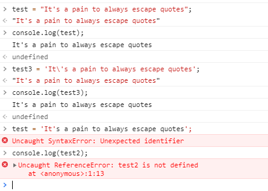

**Student Name**:  Sharon Wong

**NetID**: hd3647

# Homework #11 Solutions

## Question 1

### (a)

```JSON
{
    "$schema": "http://json-schema.org/draft-07/schema#",
    "id": "",
    "title": "Member format base",
    "descriptions": "Member format for import and export. By Sharon Wong",
    "type": "object",
    "properties": {
        "_id": {
            "type": "string"
        },
        "firstName": {
            "type": "string",
            "minLength": 1,
            "maxLength": 40
        },
        "lastName": {
            "type": "string",
            "minLength": 1,
            "maxLength": 40
        },
        "email": {
            "type": "string",
            "format": "email"
        },
        "role": {
            "type": "string",
            "enum": ["member", "admin"]
        },
        "password": {
            "type": "string"
        }
    },
    "required": ["firstName", "lastName", "email", "role", "password"],
    "additionalProperties": false
}
```

```javascript
function validate(schema, data) {
  if (!ajv.validate(schema, data)) {
    ajv.errors.forEach(function(error) {
      console.log(error.message + "\n" + JSON.stringify(error));
    });
    return false;
  }
  return true;
}

...
var valid = validate(memberSchema, newMember);
if (!valid) {
  res.status(400).json({
    error: true,
    message: valid
  });
}
```

### (b)

```JSON
{
  "name": "A Satisfying Dinner",
  "dates": "September 21st, September 25th, September 30th, October 5th, October 9th",
  "description": "Wanted to try something new, but didn't think you'd have the time after a long day at work? We'll try recipes that are both quick to make and fulfilling to eat!"
}

```

```JSON
{
    "$schema": "http://json-schema.org/draft-07/schema#",
    "id": "",
    "title": "Activity format base",
    "descriptions": "Activity format for import and export. By Sharon Wong",
    "type": "object",
    "properties": {
        "_id": {
            "type": "string"
        },
        "name": {
            "type": "string",
            "minLength": 1,
            "maxLength": 40
        },
        "dates": {
            "type": "string",
            "minLength": 1,
            "maxLength": 1000
        },
        "description": {
            "type": "string",
            "minLength": 1,
            "maxLength": 3000
        }
    },
    "required": ["name", "dates", "description"],
    "additionalProperties": false
}
```

## Question 2

### (a)

```javascript
function jsonErrors(err, req, res, next) {
  const status = err.status || 500;
  res.status(status);
  res.json('Something went wrong.');
  console.log(err.message + "\n" + JSON.stringify(err));
}
```

### (b)

```json
{
   "name": "Pending Applicant1",
   "email": "applicant1@cvcooking.com",
   "findus": "Word of Mouth",
   "comments": "Lorem ipsum dolor sit amet, consectetur adipiscing elit. Proin ut nisl eget dolor placerat imperdiet. Etiam porttitor a ante eget pharetra. Aliquam pharetra cursus risus, nec dapibus augue viverra eu."
 }
```

```json
{
    "$schema": "http://json-schema.org/draft-07/schema#",
    "id": "",
    "title": "Applicant format base",
    "descriptions": "Applicant format for import and export. By Sharon Wong",
    "type": "object",
    "properties": {
        "_id": {
            "type": "string"
        },
        "name": {
            "type": "string",
            "minLength": 1,
            "maxLength": 40
        },
        "email": {
            "type": "string",
            "format": "email"
        },
        "findus": {
            "type": "string",
            "enum": ["Blog", "Word of Mouth", "Local Event Search", "Internet Search", "Email"]
        },
        "comments": {
            "type": "string",
            "maxLength": 1000
        }
    },
    "required": ["name", "email", "findus", "comments"],
    "additionalProperties": false
}
```

### (c)

```javascript
app.post('/applicants', express.json(), function (req, res) {
  var newApplicant = req.body;
  var valid = validate(applicantSchema, newApplicant);
  if (!valid) {
    res.status(400).json({
      error: true,
      message: JSON.stringify(valid)
    });
  }
  else {
    res.status(200).json('Applicant created successfully.');
  }
}, jsonErrors);
```

## Question 3

### (a)


### (b)


### (c)



### (d)

[Link to deployment](https://www.drbsclasses.org/student40/node/info)

## Question 4

### (a)

1. Where should the development proxy (devProxy) code be located? **with the react client code**
2. What paths are you going to forward to the server? **/info, /activities, /login, /logout, /users**
3. On what IP address and port are you going to run your club server? **IP: 127.0.0.1. port 3040**
4. On what IP address and port are you going to run your devProxy? **localhost:1234**
5. At which URL will you point your browser? **localhost:1234**
6. How many command terminals do you need and what will be running in each? **2. one for react server via the proxy (node proxy.js), and one for backend server (node clubServer.js)**
7. What additional NPM packages do you need to install and where? **parcel-bundler, express, http-proxy-middleware, all in the react project directory**
8. How can you test that the proxy is forwarding your requests? **go to one of the forwarded paths and see if the data from the backend server is returned instead. for example, I went to localhost:1234/activities and localhost:1234/info**

### (b)


