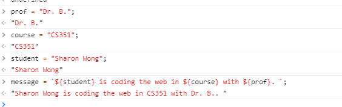
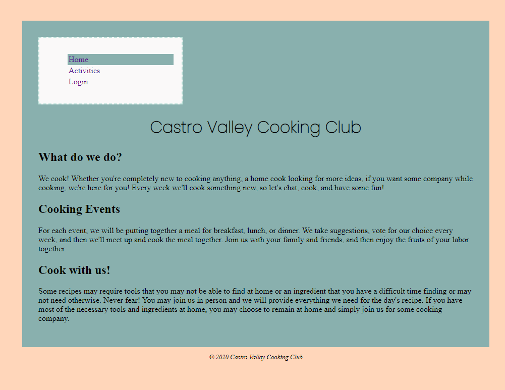

**Student Name**:  Sharon Wong

**NetID**: hd3647

# Homework #2 Solutions

## Question 1

### (a)

### (b)
1. Put site wide navigation into the <main> element? No.
2. Should you put common banners (e.g., site logo) in the <main> element? No.
3. Should you put copyright notices in the <main> element? No.

Files:
* index.html
* login.html
* activities.html

## Question 2

### (a)
We should put the `header` inside the `main` element, as it describes the contents of its ancestor `main` element.

### (b)
Yes, it is okay to put the `footer` in `main`, to describe the contents of its ancestor `main` element. It is also okay to put it as the last item in the body, as it can also describe the contents of the page as a whole.

### (c)


### (d)

```HTML
<nav>
  <ul>
    <li><a href="index.html">Home</a></li>
    <li class="active"><a href="activities.html">Activities</a></li>
    <li><a href="login.html">Login</a></li>
  </ul>
</nav>
```

## Question 3

### (a)

1. `NaN` It returns a `NaN`, because the first character of the string could not be evaluated into a digit. `NaN` is Not-a-Number.
2. `12` It ignores any character that cannot be evaluated into a digit.
3. `10` It evaluates the string on base 2.
4. `NaN` It is not the same as 2 because the first character cannot be evaluated into a digit, so the entire string evaluates to `NaN`.


### (b)


### (c)

1. Yes.
2. This does not work.
3. The single quote in the single-quoted string is being escaped with a backslash `\`.


### (d)

1. Transforms all characters in the given string to uppercase.
2. Transforms all characters in the given string to lowercase.
3. `includes` checks for whether the parameter string can be found within the given string.


### (e)



## Question 4

### (a)

1. `split` splits the string on the given string, which in this case is a space, effectively returning an array consisting of the words in the sentence.
2. `push` adds the given string into the array as the final element.
3. `join` glues the array of strings together with the separator `_`.
4. `indexOf` returns the array index of the given string, if found as an entry in the array.
5. Yes.
6. `pop` removes the final element of the array and returns it.


### (b)

1. The function takes a string as a parameter and returns the string as all uppercase.
2. `map` applies the given function onto every element of the array.
3. `noCaseSort` is a comparison function that will ignore the case of the character of the string. When typically comparing strings, uppercase characters will always be greater than any lowercase characters. This comparison is ignoring the case, so it will always compare based on the lowercase character.
4. The comparison is passed to the sort function and the sort function will use the comparison to sort its array, rather than sort by the default sort method.

### (c)

1. The property `favorite dessert` has a space in it and thus cannot be accessed using the object dot notation.
2. Yes.


## Question 5

### (a)

[Poppins](https://fonts.google.com/specimen/Poppins)

### (b)


[Color palette](https://coolors.co/555b6e-89b0ae-bee3db-faf9f9-ffd6ba)

### (c)


### (d)


