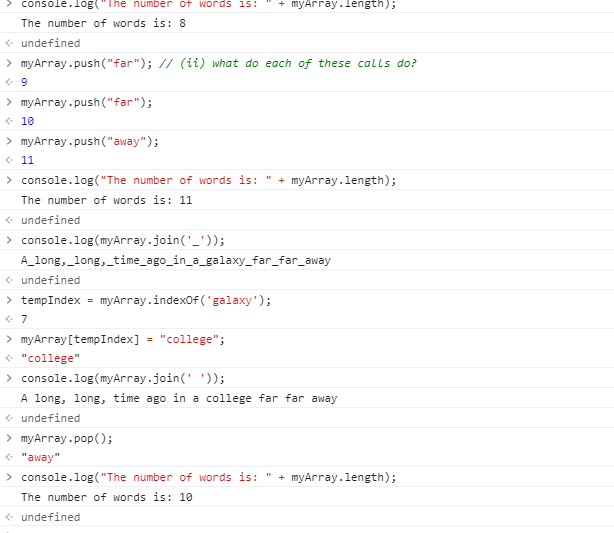

**Student Name**:  Sharon Wong

**NetID**: hd3647

# Homework #8 Solutions

## Question 1

### (a)

```IPv4 address: 192.168.1.72
mac address: 04:d3:b0:41:20:58
```

### (b)

Ethernet use a manual table to redirect traffic between ports. However, ethernet addresses are given based on manufacturer as opposed to network location and these addresses are how networks can differentiate between clients. Because ethernet addresses are done manually and by device, the table used by ethernet cannot scale for the entire internet, which is why Internet Protocol (IP) exists.

### (c)

```
https://developer.mozilla.org/en-US/docs/Web/JavaScript/Guide/Grammar_and_Types#Comments
protocol: https
domain: developer.mozilla.org
port:
path: /en-US/docs/Web/Javascript/Guide/Grammar_and_Types
query:
fragment portions: #Comments

https://www.google.com/search?q=gaia+mission&rlz=1CYPO_enUS751
protocol: https
domain: www.google.com
port:
path: search
query: q=gaia+mission&rlz=1CYPO_enUS751
fragment portions:

http://127.0.0.2:8282/static/index.html
protocol: http
domain: 127.0.0.2
port: 8282
path: index.html
query:
fragment portions:
```

## Question 2

### (a)

GET.
200: means successful response.
https.

### (b)

Request Headers
```
GET / HTTP/1.1
Host: bb.csueastbay.edu
Connection: keep-alive
Cache-Control: max-age=0
Upgrade-Insecure-Requests: 1
User-Agent: Mozilla/5.0 (Windows NT 10.0; Win64; x64) AppleWebKit/537.36 (KHTML, like Gecko) Chrome/86.0.4240.111 Safari/537.36
Accept: text/html,application/xhtml+xml,application/xml;q=0.9,image/avif,image/webp,image/apng,*/*;q=0.8,application/signed-exchange;v=b3;q=0.9
Sec-Fetch-Site: none
Sec-Fetch-Mode: navigate
Sec-Fetch-User: ?1
Sec-Fetch-Dest: document
Accept-Encoding: gzip, deflate, br
Accept-Language: en-US,en;q=0.9
Cookie: _ga=GA1.2.955148904.1594316741; _gcl_au=1.1.754180272.1597773571; __utmz=208548673.1597859182.4.2.utmcsr=csueastbay.edu|utmccn=(referral)|utmcmd=referral|utmcct=/students/academics-and-studying/blackboard.html; AWSELB=D3570BC914533D9ACC5FBEA2A258730F699E691A0AC95F4514958C9FF4BF56EAF7767641A5CF23231EED62A29DC2BE901660F86BA0932434643D6A2162D32D3DA82515A3D4; AWSELBCORS=D3570BC914533D9ACC5FBEA2A258730F699E691A0AC95F4514958C9FF4BF56EAF7767641A5CF23231EED62A29DC2BE901660F86BA0932434643D6A2162D32D3DA82515A3D4; __utma=208548673.955148904.1594316741.1603487335.1603656816.72; __utmc=208548673; __utmt=1; __utmb=208548673.1.10.1603656816; JSESSIONID=A17ED2F9DB4352DF67E3A897422B3F94; BbRouter=expires:1603658619,id:44BB2A1D03459D8FEEB0A69969F80617,signature:2a6622e67841ba6c3be222528fb3214ee09678ee80f3444ab4fce18cdc19289a,site:aefdf5db-8c6a-4e8e-8bf7-fb9f1f4dcdf0,v:2,xsrf:474205d4-a15a-46a6-8e13-8177e1540fd0
```

### (c)

Response Headers
```
HTTP/1.1 200
Cache-Control: private
Cache-Control: max-age=0
Cache-Control: no-store
Cache-Control: must-revalidate
Content-Encoding: gzip
Content-Language: en-US
Content-Security-Policy: frame-ancestors 'self'
Content-Type: text/html;charset=UTF-8
Date: Sun, 25 Oct 2020 20:13:44 GMT
Expires: Fri, 25 Oct 2019 20:13:44 GMT
Last-Modified: Wed, 25 Oct 2000 20:13:44 GMT
P3P: CP="CAO PSA OUR"
Pragma: private
Server: openresty/1.9.3.1
Set-Cookie: BbRouter=expires:1603658624,id:44BB2A1D03459D8FEEB0A69969F80617,signature:df305af49331eccc881ededbcec0399b7f9b37776ea92293cbfeca43d428f027,site:aefdf5db-8c6a-4e8e-8bf7-fb9f1f4dcdf0,v:2,xsrf:474205d4-a15a-46a6-8e13-8177e1540fd0; Path=/; Secure; HttpOnly
vary: accept-encoding
X-Blackboard-appserver: ip-10-145-29-170.ec2.internal
X-Blackboard-product: Blackboard Learn &#8482; 3800.19.0-rel.54+54663c8
X-Frame-Options: SAMEORIGIN
Content-Length: 18754
Connection: keep-alive

```

### (d)

Blackboard's appserver is `ip-10-145-29-170.ec2.internal`.

There's a cookie set:

```
_ga=GA1.2.955148904.1594316741; _gcl_au=1.1.754180272.1597773571; __utmz=208548673.1597859182.4.2.utmcsr=csueastbay.edu|utmccn=(referral)|utmcmd=referral|utmcct=/students/academics-and-studying/blackboard.html; AWSELB=D3570BC914533D9ACC5FBEA2A258730F699E691A0AC95F4514958C9FF4BF56EAF7767641A5CF23231EED62A29DC2BE901660F86BA0932434643D6A2162D32D3DA82515A3D4; AWSELBCORS=D3570BC914533D9ACC5FBEA2A258730F699E691A0AC95F4514958C9FF4BF56EAF7767641A5CF23231EED62A29DC2BE901660F86BA0932434643D6A2162D32D3DA82515A3D4; __utma=208548673.955148904.1594316741.1603487335.1603656816.72; __utmc=208548673; __utmt=1; __utmb=208548673.1.10.1603656816; JSESSIONID=A17ED2F9DB4352DF67E3A897422B3F94; BbRouter=expires:1603658619,id:44BB2A1D03459D8FEEB0A69969F80617,signature:2a6622e67841ba6c3be222528fb3214ee09678ee80f3444ab4fce18cdc19289a,site:aefdf5db-8c6a-4e8e-8bf7-fb9f1f4dcdf0,v:2,xsrf:474205d4-a15a-46a6-8e13-8177e1540fd0
```

## Question 3

### (a)

```
DNS Servers:
[ '2600:1700:5fa1:c8b0::1', '192.168.1.254' ]
```

### (b)

```
Address for mynoise.net
[ '77.111.240.110' ]
```

### (c)

```
All the info for wikipedia.org:
[
  { address: '198.35.26.96', ttl: 7, type: 'A' },
  { value: 'ns2.wikimedia.org', type: 'NS' },
  { value: 'ns0.wikimedia.org', type: 'NS' },
  { value: 'ns1.wikimedia.org', type: 'NS' }
]
```
## Question 4

### (a)



### (b)


## Question 5

### (a)


### (b)

```javascript
const fs = require('fs');
var express = require('express');
var app = express();
var eventsRaw = fs.readFileSync('./eventData.json');
var events = JSON.parse(eventsRaw);

app.get('/info', function (req, res) {
  clubData = {
    "clubName": "Castro Valley Cooking Club",
    "ownerName": "Sharon Wong",
    "ownerNetId": "hd3647"
  }
  res.json(clubData);
});

app.get('/activities', function (req, res) {
  res.json(events);
});

app.listen(3001, function () {
    console.log(`Club server listening on IPv4: http://localhost:3001`);
});

```
### (c)


### (d)

```JavaScript
app.post('/activities', function(req, res) {
  var newEvent = req.body;
  events.push(newEvent);
  res.json(events);
});

```

### (e)

```JavaScript
const fetch = require('node-fetch');

let site = {
  url: 'http://localhost:3001'
};

var body = {
  "name": "Test Event",
  "dates": [
    "September 20th"
  ],
  "description": "Lorem ipsum dolor sit amet, consectetur adipiscing elit. Etiam nisl mi, sagittis quis tellus in, sodales tincidunt neque. Donec non scelerisque diam."
};

let p3 = fetch(site.url +'/activities', {
            method: "POST",
            body: JSON.stringify(body),
            headers: { 'Content-Type': 'application/json' }
          })
          .then(res => res.json())
          .then(data => {
            console.log(`Updated Club Activities:`)
            console.log(data);
          }
        );


console.log("Testing web requests...");
Promise.all([p3]);
```
