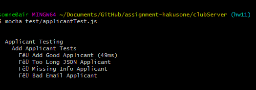

**Student Name**:  Sharon Wong

**NetID**: hd3647

# Homework #3 Solutions

## Question 1

### (a)

- index.html
- activities.html


### (b)
- &#127858; 127858
- &#127837; 127837
- &#129386; 129386


## Question 2

### (a)

### (b)

```html
<table>
  <caption>Cooking club events</caption>
  <thead>
    <tr>
      <th>Name</th>
      <th>Times</th>
      <th>Description</th>
    </tr>
  </thead>
    <tr>
      <td>A Serene Breakfast</td>
      <td>Saturday, Sunday, mornings</td>
      <td>We take our ease on weekend mornings and make an assortment of cozy breakfast foods to end your weekend on a bright note.</td>
    </tr>
    <tr>
      <td>A Satisfying Dinner</td>
      <td>Monday, Wednesday, Friday, afternoons</td>
      <td>Wanted to try something new, but didn't think you'd have the time after a long day at work? We'll try recipes that are both quick to make and fulfilling to eat!</td>
    </tr>
    <tr>
      <td>A Delightful Dessert</td>
      <td>Friday, Saturday, or Sunday, evenings</td>
      <td>We try our hand at a sweet or savory dessert dish. Get creative and make enough to share!</td>
    </tr>
  <tbody>
  </tbody>
</table>
```

### (c)


## Question 3

### (a)


### (b)

[Link to website](http://csweb01.csueastbay.edu/~hd3647/clubProject_hw3/index.html)

## Question 4

### (a)

`states` is an array of Objects. To find the length of this array: `states.length`

### (b)

population total: 315482390

```javascript
const reducer = (accumulator, currentValue) => accumulator + currentValue;
const population = states.map(state => state.population);
console.log(population.reduce(reducer));
```

### (c)

```javascript
let sortedStates = states.sort(function(a, b) { return b.population - a.population});
let largestStates = sortedStates.slice(0, 5).map(s => s.state);
console.log(largestStates);
```

## Question 5

### (a)

```javascript
document.getElementById('PageTitle').innerHTML ='Sharon Wong: hd3647';
```


### (b)

```javascript
const newEl = document.createElement("p");
const newContent = document.createTextNode("Hi from Sharon Wong, building pages in code is fun!");
newEl.appendChild(newContent);
const currentDiv = document.getElementById("IntroSection");
currentDiv.appendChild(newEl);
newEl.classList.add("fun");
```


