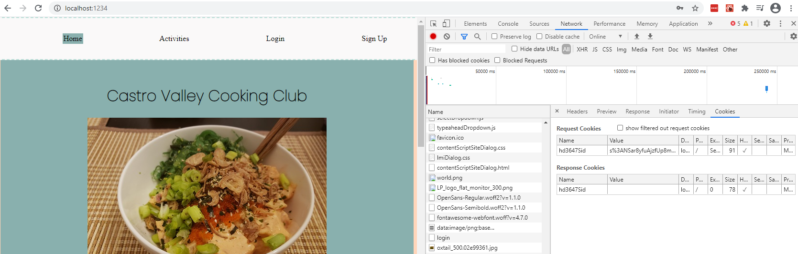
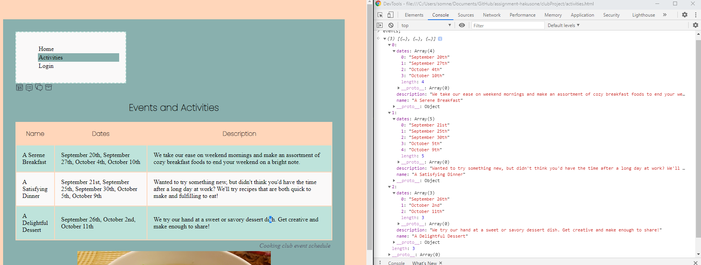
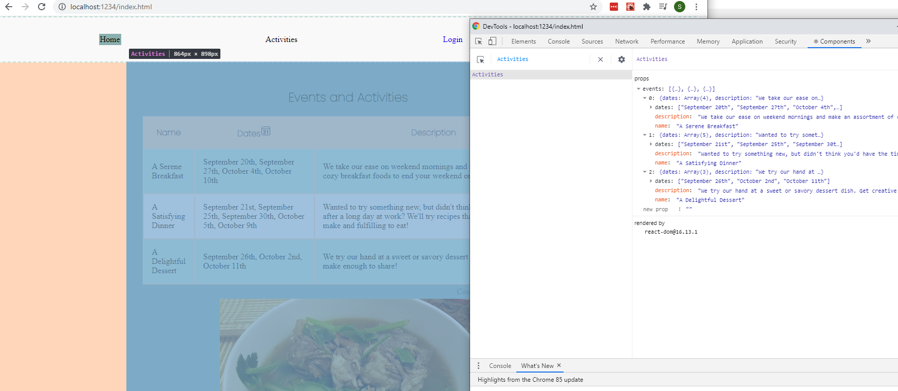
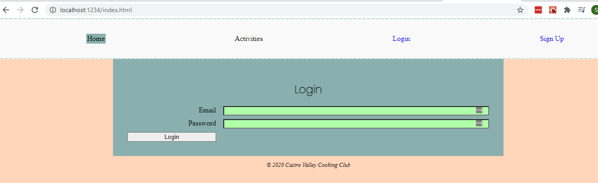
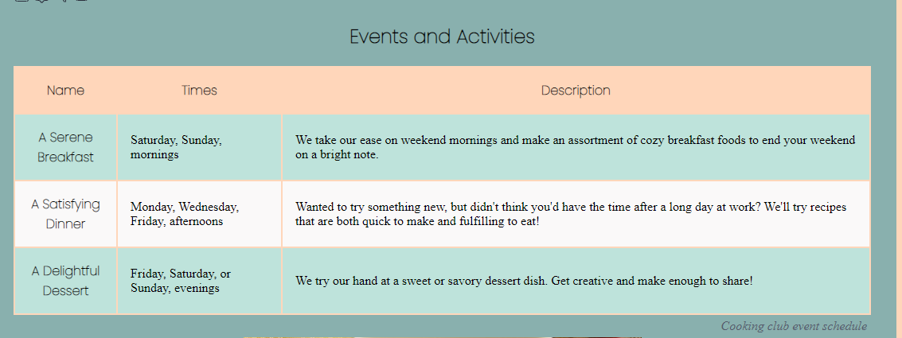
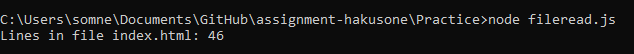
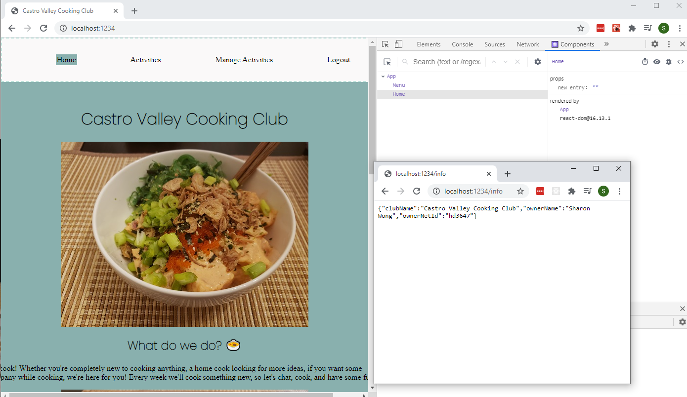
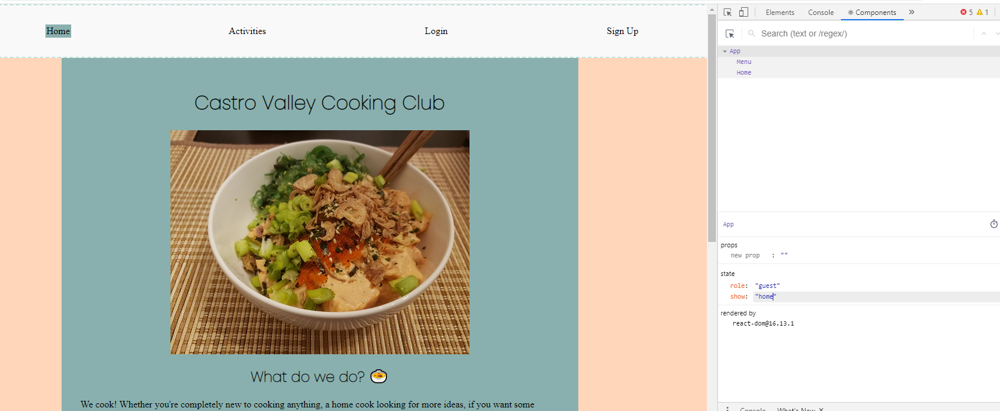

**Student Name**:  Sharon Wong

**NetID**: hd3647

# Homework #6 Solutions

## Question 1

### (a)

### (b)

menu.js



### (c)

home.js



## Question 2

### (a)

```javascript
import React, {Component} from 'react';
import oxtail from '/images/oxtail_500.jpg';

class Activities extends React.Component {
  constructor(props) {
    super(props);
  }

  render() {
    let events = this.props.events;
    let rows = events.map(function(event) {
      let dates = event.dates.join(', ');
      return <tr>
                <td>{event.name}</td>
                <td>{dates}</td>
                <td>{event.description}</td>
             </tr>;
    });

    let table = <table>
      <caption>Cooking club event schedule</caption>
      <thead>
        <th>Name</th>
        <th>Dates
          <svg height="21" viewBox="0 0 21 21" width="21" xmlns="http://www.w3.org/2000/svg"><g fill="none" fill-rule="evenodd" transform="translate(2 2)"><path d="m2.5.5h12c1.1045695 0 2 .8954305 2 2v11.9903615c0 1.1045695-.8954305 2-2 2h-12c-1.1045695 0-2-.8954305-2-2v-11.9903615c0-1.1045695.8954305-2 2-2z" stroke="#2a2e3b" stroke-linecap="round" stroke-linejoin="round"/><path d="m.659 4.5h15.841" stroke="#2a2e3b" stroke-linecap="round" stroke-linejoin="round"/><path d="m4.81640625 11.1552734v-1.0791015h.87890625c.66894531 0 1.12304688-.39550784 1.12304688-.97167971 0-.52734375-.41503907-.92773438-1.10351563-.92773438-.71289063 0-1.15234375.36621094-1.20117187.99609375h-1.36230469c.04882812-1.29882812 1.04980469-2.17285156 2.63671875-2.17285156 1.5625 0 2.43164062.86425781 2.42675781 1.89453125-.00488281.85449219-.54199219 1.41601565-1.29882813 1.60156255v.0927734c.98144532.1416016 1.57714844.7666016 1.57714844 1.7089844 0 1.2353515-1.16210937 2.109375-2.75390625 2.109375-1.59179687 0-2.67578125-.8691407-2.73925781-2.2021485h1.41113281c.04394531.5957031.55175781.9765625 1.30859375.9765625.74707032 0 1.26953125-.4052734 1.26953125-1.015625 0-.625-.48828125-1.0107422-1.27929687-1.0107422zm6.69433595 3.0712891v-5.61035156h-.0878906l-1.72851566 1.19140625v-1.37207031l1.82128906-1.25488282h1.4697266v7.04589844z" fill="#2a2e3b"/></g></svg>
        </th>
        <th>Description</th>
      </thead>
      <tbody>
        {rows}
      </tbody>
    </table>;

    let main = <main>
      <header>
        <h2>Events and Activities</h2>
        </header>
          {table}
        
    </main>;

    let footer = <footer>
      &copy; 2020 Castro Valley Cooking Club
    </footer>;

    return <div>{main} {footer}</div>;
  }
}

export default Activities;
```



### (b)

login.js



### (c)

membership.js



## Question 3

### (a)

### (b)



```javascript
  let contents = null;

  switch (this.state.show) {
    case "home":
      contents = <Home />;
      break;
    case "activities":
      contents = <Activities events={events} />;
      break;
    case "login":
      contents = <Login />;
      break;
    case "membership":
      contents = <Membership />;
      break;
    default:
      contents = <h2>Something went wrong.</h2>;
      break;
  }

  return (
    <>
      <Menu />
      {contents}
  </>);
```

## Question 4

### (a)

* guest: home, activities, login, membership
* user: home, activities, logout
* admin: home, activities, logout

### (b)

user:



guest:



### (c)

```javascript
let contents = null;

let roleNav = {
  "guest" : ["home", "activities", "login", "membership"],
  "user" : ["home", "activities", "logout"],
  "admin" : ["home", "activities", "logout"],
}

let roleNavOptions = roleNav[this.props.role];
let activeComponent = this.props.show;

let displayNavOptions = [];

roleNavOptions.forEach(function (option) {
  var isActive = activeComponent == option ? 'active' : '';
  switch (option) {
    case "home":
      displayNavOptions.push(<li key="home" className={isActive}><a>Home</a></li>);
      break;
    case "activities":
      displayNavOptions.push(<li key="activities" className={isActive}><a>Activities</a></li>);
      break;
    case "login":
      displayNavOptions.push(<li key="login" className={isActive}><a>Login</a></li>);
      break;
    case "membership":
      displayNavOptions.push(<li key="membership" className={isActive}><a>Sign Up</a></li>);
      break;
    case "logout":
      displayNavOptions.push(<li key="logout" className={isActive}><a>Logout</a></li>);
    break;
    default:
      break;
  }
});

contents = <nav>
  <ul>
    {displayNavOptions}
  </ul>
</nav>

return contents;

```
## Question 5

[Link to website](http://csweb01.csueastbay.edu/~hd3647/clubReact_hw6/)
