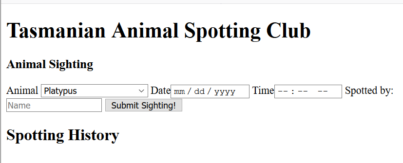
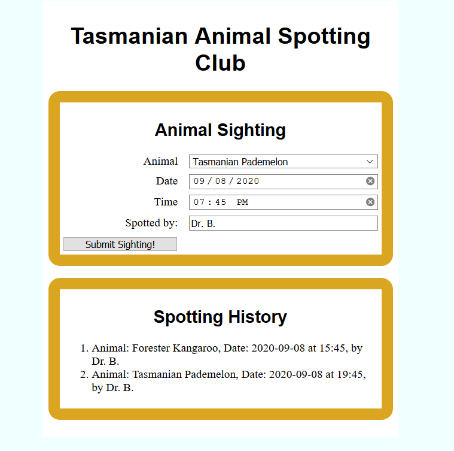
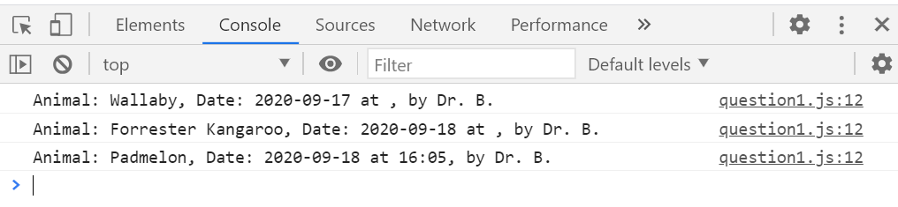

# Instructions: Question 1 User Interaction (25 pts)

You are starting building a web app for a wildlife observation club.
You are provided with the following files:

* An `index.html` file. **This cannot be modified.**

* A `question1c.css` CSS file. You will be adding styling to the bottom of this file (and leaving the top alone). 

* A `question1c.js` JavaScript file. This is empty except for some comments. All your JavaScript for this problem goes here. This file is referenced at the end of the `index.html` file. 

You will update the `question1c.css` and the `question1c.js` files to provide the following functionality. Prior to your work the HTML page will look like:

## (a) CSS Styling Basics (5 pts)

The example "finished" page is shown below.

* Set the font to "san serif" and center the headings as in the finished page

* Set the border as in the screenshot with the color name: *goldenrod*.

* Set "spacing" to roughly achieve the look in the finished page (exact values are not critical, but you must have some space where there is some shown in the screenshot)

## (b) CSS Grid for Inputs/Selectors (5 pts)

Use CSS grid to style the inputs as shown in the finished picture.

## (c) Button Click (8 pts)

Write JavaScript code (in file discussed above) that outputs information about a "sighting" to the **developers console** when the user clicks the "Submit Sighting" button. For example here is what I output to my dev console for some button clicks with different inputs:

## (d) DOM creation (7 pts)

Write additional JavaScript to create and add new list items to the list in the "Spotting History" section with each button click as show in the "finished" page screenshot shown above.

