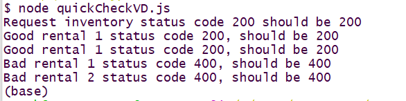

# Question 1: A Validating JSON Server (25 pts)

You are starting work on a *server* for the backend of a web application for the **Windsurf Sails Here** rental shop for wind sports gear. Customers go into the shop pick out their gear and the shop keeper enters information about the *rental* that then gets sent to a *server*. **Note**: only provide the functionality specifically requested or you will run out of time!

You are given the following files:

* `inventoryVB.json` contains the rental shop's complete inventory. Does **not** need to be modified.

* `renterVB.json` is an example of a *valid* rental data that would be sent to your server. For *reference* purposes only, you do not need to use this in your code.

* `quickCheckVB.js` is a test file to quickly test your server. I will be performing **more** than these tests. This contains examples of *good* and *bad* inputs.

## (a) JSON schema for a particular type of data (15 pts)

Create a file `rentalSchema.json` that contains a JSON schema to validate *rental* information that gets sent to the server. There should be reasonable checks for all inputs. See the `renterVB.json` file for the structure *valid* **rental** object.

Additional constraints:

* All rentals must include *renterInfo* and have reasonable length strings for both *name* and *cell*.

* Customers can rent more than one item hence an array is used to store equipment type and quantity. The types of items and their quantities should have reasonable limits. **Note** a schema cannot know about "dynamic" quantities in an inventory so only reasonable "limits" can be used.

The schema must run as part of the server in part (b) to receive credit. If your
schema doesn't compile you will not receive **any** credit. I will **not** be debugging anyone's schemas just testing them and reviewing them for code quality.

## (b) Server Implementation (10 pts)

You will create a file `rentalServer.js` for an `express.js` based server with
the following functionality:

* Server must run on port 3220 on *localhost*.

* Return store total inventory (the initial inventory, not what remains) GET path `/inventory`. This should be very simple.

* Keeps a list of *rentals* in an array. This should be very simple.

* Implements a POST `/rentals` interface to take in rentals. This should return 200 status code on success and add the information to the *rentals* array. On validation failure a 400 status code should be returned. No other error checking is required. You can return an JSON object with a message in either case, the details are not important and will not be checked. **DO NOT** change inventory information here, that is an extra unneeded complication and too much work.

* Implements a GET `/rentals` interface to furnish a list of all current rentals. This should be very simple.

**Tip**: When I run the `quickCheckVB.js` program against my solution server I get the following output.

