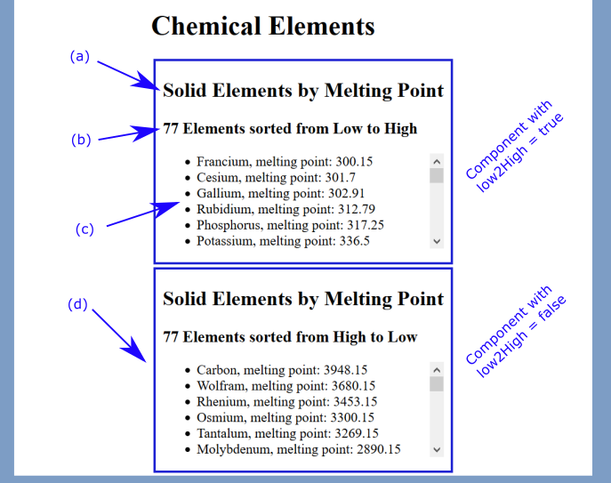

# Question 2 "Solids by Melting Point" (25 pts, Variant C)

You are developing a component for a React based App for a CSU East Bay chemistry course. The `index.html`, `index.js`, and styling (`question1.css`) files have been completed for you. You just need to develop the React component.

You are provided with the following files:

* An `index.html`. **This cannot be modified.**

* A `index.js` file containing the main React App. **This cannot be modified.** Your component must be compatible with this file, i.e., this file will be importing and using your component.

* A `question1.css` CSS file that contains all the CSS for the site. This **cannot** be modified.

* A `elements.json` file which contains information about the chemical elements. This **cannot** be modified or imported into your components.

You will deliver to me one JavaScript file for a "Solids by Melting Point" React component you will create. This file must implement the functionality described below. A screenshot of the finished App with annotations (in blue) is shown below.

## (a) Create Files and Base Functional Component (5 pts)

* Create a JavaScript file for the component compatible with that imported in the `index.js` file.
* Creating the appropriately named (compatible with `index.js`) React *functional* component in this file.
* Return a `<section>` with an `<h2>` with "Solid Elements by Melting Point" from the component.

## (b) Filter by `solid` phase (5 pts)

* Extract only the elements with the *phase* of *solid* from the chemical elements passed to your component.
* Have your component list the number of normally 'solid' phase elements as shown in the screenshot use an `<h3>` element for this information.

## (c) "Solids by Melting Point" Sorted Low to High Functionality (10 pts)

You will now give your "Solids by Melting Point" component the following additional functionality:

* Sort the *solids* in order of increasing "Melting Point"
* Display an unordered list `<ul>` of *solids* as shown in the screenshot

## (d) "Solids by Melting Point" High to Low via Props Functionality (5 pts)

* Have your component pay attention to the *low2High* property. When it is *false* have the component sort in the reverse order from part (b) and display as shown in the lower half of the screenshot.
